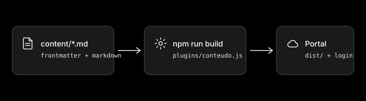

## Imagens

Coloque o arquivo em `content/assets/` e referencie como `assets/<arquivo>`. O build copia a pasta para dentro do portal, atrás do login, e um arquivo que não existe derruba o build com o nome da seção.



Formatos aceitos: SVG, PNG, JPG, WebP, AVIF e GIF. Prefira SVG monocromático para diagramas e capturas em PNG com o tema escuro, que é o padrão do portal.

## O diagrama

O mapa da seção seguinte vem de `content/diagrama.yaml`. Você declara raias (colunas), nós (com a raia e a linha de cada um) e ligações; o portal calcula as posições e desenha as setas. Um trecho do arquivo de exemplo:

```yaml
titulo: Como o portal é construído
raias:
  - id: escrever
    titulo: Escrever
  - id: construir
    titulo: Construir
nos:
  - id: markdown
    raia: escrever
    linha: 1
    titulo: Arquivos markdown
    icone: documento
    ficha:
      definicao: A fonte de tudo o que aparece no portal.
ligacoes:
  - de: markdown
    para: plugin
    rotulo: lidos no build
```

Cada nó pode ter uma `ficha` com `definicao`, `como` (pares rótulo e texto), `exemplo` e `nunca`; a ficha abre ao clicar ou ao pressionar Enter no nó. `estado: futuro` marca o que ainda não existe com borda tracejada e relógio. `tipo: plataforma` engrossa a borda. `grupos` desenha uma caixa tracejada em volta de um conjunto de nós.

Para desligar o diagrama, apague o arquivo ou coloque `"diagrama": { "ativo": false }` na configuração.
